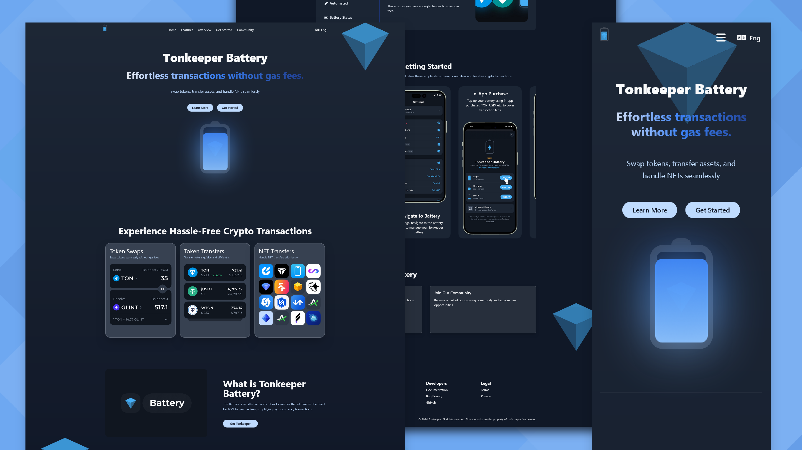

# Tonkeeper Battery

Effortless transactions without gas fees. Swap tokens, transfer assets, and handle NFTs seamlessly with Tonkeeper Battery.



## Table of Contents

- [Overview](#overview)
- [Features](#features)
- [Project Structure](#project-structure)
- [Installation](#installation)
- [Usage](#usage)
- [Contribution](#contribution)
- [Contact](#contact)

## Overview

Tonkeeper Battery is a user-friendly application that allows seamless transactions without gas fees. This project includes functionalities such as token swaps, token transfers, NFT transfers, and more.

## Features

- Token Swaps
- Token Transfers
- NFT Transfers
- Battery Status Management
- Community Engagement

## Project Structure

tonkeeper-battery/
├── node_modules/
├── public/
│ ├── images/
│ │ ├── brands-logo/
│ │ ├── logo/
│ │ ├── video/
│ │ ├── Automated.png
│ │ ├── Create New Wallet.png
│ │ ├── Download the App.png
│ │ ├── Inapp purchase.png
│ │ ├── NFTs.png
│ │ ├── Open Battery.png
│ │ ├── Open Settings.png
│ │ ├── photo_2024-05-01_15-21-33.png
│ │ ├── photo_2024-06-24_15-33-58.png
│ │ ├── Purchase.png
│ │ ├── Receive Tokens.png
│ │ ├── token swap.png
│ │ ├── Token Transfers.png
├── src/
│ ├── assets/
│ │ ├── images/
│ ├── components/
│ │ ├── BackgroundImages.jsx
│ │ ├── CTA.jsx
│ │ ├── DownloadLinkButton.jsx
│ │ ├── Features.jsx
│ │ ├── Footer.jsx
│ │ ├── Header.jsx
│ │ ├── Hero.jsx
│ │ ├── HowToGetStarted.jsx
│ │ ├── LinkButton.jsx
│ │ ├── Overview.jsx
│ ├── pages/
│ ├── styles/
│ │ ├── App.css
│ ├── App.jsx
│ ├── main.jsx
│ ├── index.html
│ ├── .eslintrc.cjs
│ ├── .gitignore
│ └── README.md
├── package.json
├── tailwind.config.js
├── postcss.config.js
├── vite.config.js

---


## Installation

To get started with this project, clone the repository and install the dependencies:

```bash
git clone https://github.com/your-username/tonkeeper-battery.git
cd tonkeeper-battery
npm install
```

---

## Install Tailwind CSS

```bash
npm install -D tailwindcss postcss autoprefixer
npx tailwindcss init
```

---

Add the following to your tailwind.config.js file:

```bash
module.exports = {
  content: [
    "./src/**/*.{js,jsx,ts,tsx}",
    "./public/index.html",
  ],
  theme: {
    extend: {},
  },
  plugins: [],
}
```

---

Add the following to your src/styles/App.css file:

```bash
@tailwind base;
@tailwind components;
@tailwind utilities;
```

---

## Install Font Awesome

```bash
npm install --save @fortawesome/fontawesome-svg-core @fortawesome/free-solid-svg-icons @fortawesome/react-fontawesome
```

---

Import Font Awesome in your project (e.g., src/App.jsx):

```bash
import { library } from '@fortawesome/fontawesome-svg-core';
import { fas } from '@fortawesome/free-solid-svg-icons';

library.add(fas);

```

---

## Usage

To start the development server, run:

```bash
npm run dev
```

---

## Contribution

This project is part of the Tonkeeper Battery Contest. Contributions towards enhancing battery efficiency and innovative ideas for managing battery status are welcome. Please submit your entries and suggestions through the contest portal.

## Contact

- [LinkedIn](https://www.linkedin.com/in/upovibe/)
- [x](https://www.x.com/upovibe/)
- [Telegram](https://t.me/upovibe)
